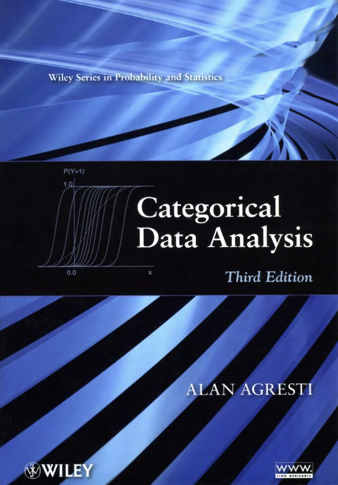

# Categorical Data Analysis {-}

Study how to use `R` for categorical data in view of @Agresti:2012aa



# Software usage {-}


```{r, echo=FALSE}
R.version
```

using IDE:


```{r, echo=FALSE}
rstudioapi::versionInfo()
```

