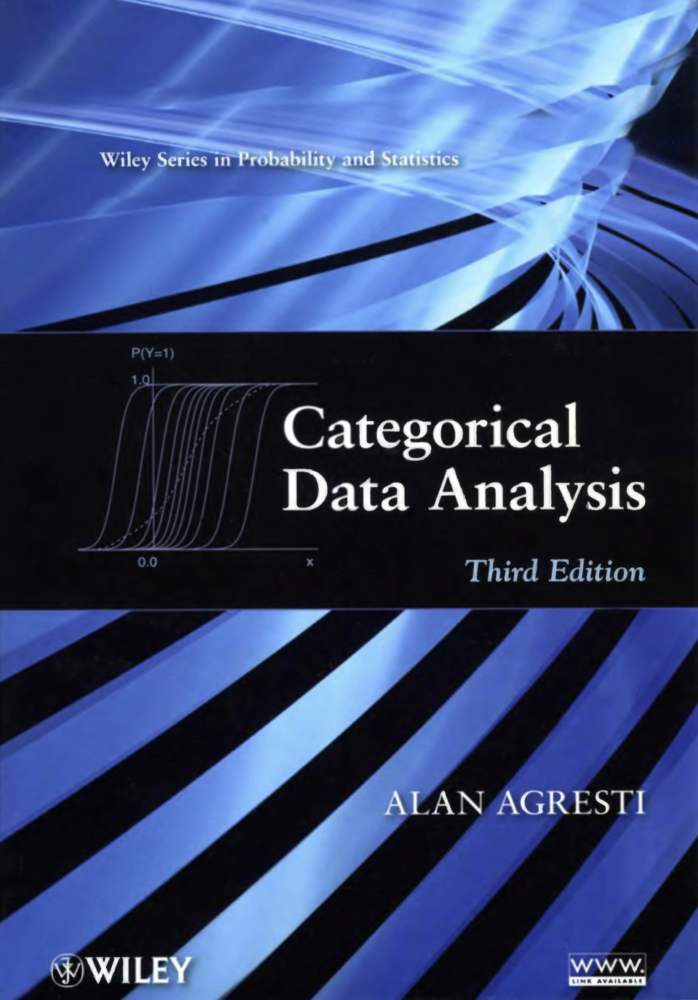

---
title: "Categorical Data Analysis Lab"
author: |
  | Young-geun Kim
  | Department of Statistics, Sungkyunkwan university
  | \href{mailto: dudrms33@g.skku.edu}{dudrms33@g.skku.edu}
date: "18 Dec, 2018"
knit: "bookdown::render_book"
bibliography: book.bib
indent: yes
numbersections: true
lot: yes
lof: yes
cover-image: cover.png
documentclass: book
header-includes:
- \setlength{\parskip}{1em}
- \setlength{\baselineskip}{1ex}
- \usepackage{multirow}
- \usepackage{float}
---

# Categorical Data Analysis {-}

Study how to use `R` for categorical data in view of @Agresti:2012aa



# Software usage {-}


```
               _                           
platform       x86_64-apple-darwin15.6.0   
arch           x86_64                      
os             darwin15.6.0                
system         x86_64, darwin15.6.0        
status                                     
major          3                           
minor          5.1                         
year           2018                        
month          07                          
day            02                          
svn rev        74947                       
language       R                           
version.string R version 3.5.1 (2018-07-02)
nickname       Feather Spray               
```

using IDE:


