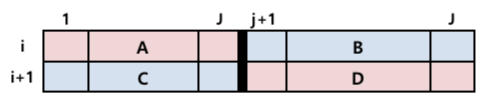

# Multinomial Responses

```{r lib, message=FALSE}
# wrangling data -------------------------------------
library(tidyverse)
# library(data.table)
# fitting the models ---------------------------------
library(VGAM)
# coloring tables -code will be hidden----------------
library(formattable)
# https://stackoverflow.com/questions/34983822/how-to-have-r-formattable-rendered-to-pdf-output-and-how-to-have-percents-in-the
export_formattable <- function(f, file, background = "white", delay = 0.2, ...)
{
  w <- as.htmlwidget(f, ...)
  path <- htmltools::html_print(w, background = background, viewer = NULL)
  url <- paste0("file:///", gsub("\\\\", "/", normalizePath(path)))
  webshot::webshot(url,
          file = file,
          selector = ".formattable_widget",
          delay = delay)
}
```

## Nomial Response

## Alligator Food Choice {-}

```{r, message=FALSE}
(ali <- read_delim("data/Alligators.dat", delim = " "))
```

> primary food choice of alligators: Fish(1), Invertible(2), Reptile(3), Bird(4), Other(5)

- `lake`
    - `Hancock`(1)
    - `Oklahoma`(2)
    - `Trafford`(3)
    - `George`(4)
- `gender`
    - `Male`(1)
    - `Female`(2)
- `size`
    - `<= 2.3 meters long`(1)
    - `> 2.3 meters long`(2)

```{r}
ali <-
  ali %>% 
  mutate_at(
    .vars = vars(-count),
    .funs = funs(factor)
  ) %>% 
  mutate(food = fct_recode(
    food,
    "fish" = "1",
    "inverebrate" = "2",
    "reptile" = "3",
    "bird" = "4",
    "other" = "5"
  ))
```

Contingency table:

```{r}
(ali_contin <-
  ali %>% 
  group_by(lake, gender, size) %>% 
  spread(food, count))
```

## Baseline-category logistic model

In `cbind()`, `vglm()` takes final component as baseline. Here, we take `fish` as baseline: food categories are reversed.

```{r}
(ali_base <-
  ali_contin %>% 
  vglm(cbind(other, bird, reptile, inverebrate, fish) ~ lake + size,
       data = ., family = multinomial(),
       contrasts = list(lake = contr.treatment(n = 4, base = 4),
                        size = contr.treatment(n = 2, base = 2)))) %>% 
  summary()
```

### Goodness of fit

$$H_0: \boldsymbol\beta = 0$$

```{r}
ali_basegood <-
  ali_contin %>% 
  ungroup() %>% 
  do(
    null_fit = vglm(cbind(other, bird, reptile, inverebrate, fish) ~ 1, 
                    data = ., family = multinomial()),
    gender_fit = vglm(cbind(other, bird, reptile, inverebrate, fish) ~ gender, 
                    data = ., family = multinomial(),
                    contrasts = list(gender = contr.treatment(n = 2, base = 2))),
    size_fit = vglm(cbind(other, bird, reptile, inverebrate, fish) ~ size, 
                    data = ., family = multinomial(),
                    contrasts = list(size = contr.treatment(n = 2, base = 2))),
    lake_fit = vglm(cbind(other, bird, reptile, inverebrate, fish) ~ lake, 
                    data = ., family = multinomial(),
                    contrasts = list(lake = contr.treatment(n = 4, base = 4))),
    add_fit = vglm(cbind(other, bird, reptile, inverebrate, fish) ~ lake + size, 
                    data = ., family = multinomial(),
                   contrasts = list(lake = contr.treatment(n = 4, base = 4),
                                    size = contr.treatment(n = 2, base = 2))),
    full_fit = vglm(cbind(other, bird, reptile, inverebrate, fish) ~ gender + lake + size, 
                    data = ., family = multinomial(),
                    contrasts = list(lake = contr.treatment(n = 4, base = 4),
                                     size = contr.treatment(n = 2, base = 2),
                                     gender = contr.treatment(n = 2, base = 2)))
  )
```

```{r, message=FALSE, warning=FALSE}
each_mod <- function(x, test = "LRT", ...) {
  mod_name <-
    as.character(x[[1]]@call)[2] %>% 
    str_extract(pattern = "(?<=~).*") %>% 
    str_trim()
  # mod_aov <- broom::tidy(anova(x[[1]], type = 1, test = "LRT"))
  # mod_aov %>% 
  #   add_column(model = rep(mod_name, nrow(mod_aov)), .before = 1)
  broom::tidy(anova(x[[1]], type = 1, test = test, ...)) %>% 
    slice(n()) %>% 
    add_column(model = mod_name, .before = 1)
}
#-----------
(ali_good <-
  ali_basegood %>% 
  map(each_mod, test = "LRT") %>% 
  bind_rows()) %>% 
  pander::pander()
```

Each differene between next row represents each

$$G^2\Big[\text{simple} \mid \text{complex} \Big]$$

For example,

$$G^2\Big[(L + S) \mid (G + L + S) \Big] = `r ali_good$Resid..Dev[5]` - `r ali_good$Resid..Dev[6]` =  `r ali_good$Resid..Dev[5] - ali_good$Resid..Dev[6]`$$

## Estimating probabilities

$$\pi_j(\mathbf{x}) = \frac{\exp(\alpha_j + \boldsymbol\beta_j^T \mathbf{x})}{1 + \sum\limits_{h = 1}^{J - 1}\exp(\alpha_h + \boldsymbol\beta_h^T\mathbf{x})}$$

```{r}
(ali_pred <-
  ali_contin %>% 
  ungroup() %>% 
  select(lake, size) %>% 
  bind_cols(predict(ali_base, newdata = ., type = "response") %>% tbl_df()))
```

## Cumulative Logits

### Happiness and Traumatic Events {-}

```{r, message=FALSE}
gss <- read_delim("data/happiness.dat", delim = " ")
```

```{r, echo=FALSE, results='asis', eval=FALSE}
gss %>% 
  group_by(race, happy) %>% 
  summarise(trauma = sum(trauma)) %>% 
  ungroup(race) %>% 
  mutate(
    race = ifelse(race == 0,
                  cell_spec(race, bold = TRUE,
                            color = "black",
                            background = "white"),
                  cell_spec(race, bold = TRUE,
                            color = "white",
                            background = "black")),
    happy = cell_spec(happy, bold = TRUE,
                      color = spec_color(happy, end = .9, option = "A", direction = -1),
                      font_size = spec_font_size(happy)),
    trauma = normalize_bar("lightgreen")(trauma)
  ) %>% 
  kable(escape = FALSE,
        col.names = c("Race", "Happiness", "Number of Traumatic Events")) %>% 
  kable_styling(bootstrap_options = "striped",
                latex_options = "HOLD_position",
                full_width = FALSE)
```

```{r, echo=FALSE, results='asis'}
customGreen0 = "#DeF7E9"
customGreen = "#71CA97"
customRed = "#ff7f7f"
# https://www.r-bloggers.com/create-stylish-tables-in-r-using-formattable/
gss %>% 
  group_by(race, happy) %>% 
  summarise(trauma = mean(trauma)) %>% 
  ungroup(race) %>% 
  formattable(
    list(
      race = color_tile("white", "grey"),
      happy = color_tile(customGreen0, customGreen),
      trauma = color_bar(customRed)
    ),
    col.names = c("Race", "Happiness", "Average number of Traumatic Events")
  ) %>% 
  export_formattable(file = "images/happy.png")
```

- There are two explanatory variables in this dataset
    - total number of traumatic accidents: $x_1$
    - whether they are Caucasian or African American: ($x_2$, 1=black, 0=white)
- these variables are used to predict the degree of happiness, which is multinomial response measured on three point scale: 1=very happy, 2=pretty happy, 3=not too happy.

With this dataset, _we want to figure out how to estimate response variable according to category and what explanatory factors influence on the response_. Look at the data. In case of white people, the more traumatic events they have had, the less happy they are. On the other hands, this relationships seems vague for black people.

Cumulative logit model is proper tool to analyze this data because response variable is ordinal response with categorical scales.

### Cumulative Probability

Consider category ordering.

\begin{equation}
P(Y \le j \mid \mathbf{x}) = \pi_1(\mathbf{x}) + \cdots + \pi_j(\mathbf{x}), \quad j = 1,\ldots, J
\label{eq:prob}
\end{equation}

### Cumulative Logits

Define logits for the cumulative probablities $\eqref{eq:prob}$ as in the other settings.

```{r, echo=FALSE}
data_frame(x = c(0, 1), y = c(0, .5)) %>%
  ggplot() +
  geom_rect(xmin = .05, xmax = .65, ymin = 0, ymax = .5, fill = 3, alpha = .2) +
  geom_rect(xmin = .65, xmax = .95, ymin = 0, ymax = .5, fill = 4, alpha = .2) +
  theme(
    panel.background = element_rect(fill = "transparent"),
    panel.grid = element_blank(),
    axis.text = element_blank(),
    axis.ticks = element_blank(),
    plot.title = element_text(hjust = .5),
    axis.title = element_blank()
    ) +
  ylim(-1, .5) +
  annotate(geom = "text",
           x = c(.1, .6, .9),
           y = .25,
           label = c(1, "j", "J")) +
  annotate(geom = "text", x = 0, y = .25, label = "Y =") +
  annotate(geom = "text", 
           x = c(.3, .65, .8), 
           y = -.3, 
           label = c("success", "/", "failure"), 
           size = 5, 
           col = c("red", "black", "blue"))
```

\begin{equation}
\begin{split}
logit P(Y \le j \mid \mathbf{x}) & = \ln\frac{P(Y \le j \mid \mathbf{x})}{1 - P(Y \le j \mid \mathbf{x})} \\
& = \ln\frac{\pi_1(\mathbf{x}) + \cdots \pi_j (\mathbf{x})}{\pi_{j + 1}(\mathbf{x}) + \pi_J(\mathbf{x})}, \quad j = 1, \ldots J
\end{split}
\label{eq:logit}
\end{equation}

This is an ordinary logit for a binary response in which categories $1$ to $j$ from a single category $j + 1$ to $J$ from the second category.

### Proportional Odds Property

Cumulative logit $\eqref{eq:logit}$ can be modeled as GLM. Each $logit P(Y \le j)$ becomes an ordinary logistic model for a binary response, i.e. $J - 1$ model with last one redundant category.

<!-- Lj notation -->

\begin{equation}
L_j(\mathbf{x}) := logit P(Y \le j \mid \mathbf{x}) = \alpha_j + \boldsymbol\beta^T\mathbf{x}, \quad j = 1, \ldots J - 1
\label{eq:model}
\end{equation}

```{r cumprob, echo=FALSE, fig.cap=fig$cap("cumprob", "Cumulative Logit for each three probabilities in a four-category case")}
logit <- function(x, a) {
  -1 / (1 + exp(x*10 - a)) + 1
}
line_col <- gg_hcl(3)
data_frame(x = seq(0, 1, by = .01)) %>%
  ggplot() +
  stat_function(aes(x = x), fun = logit, args = list(a = 5), geom = "line", col = line_col[1]) +
  stat_function(aes(x = x), fun = logit, args = list(a = 4), geom = "line", col = line_col[2]) +
  stat_function(aes(x = x), fun = logit, args = list(a = 3), geom = "line", col = line_col[3]) +
  ggrepel::geom_label_repel(data = data_frame(x = c(.5, .3, .25),
                                              y = c(logit(.5, 5), logit(.3, 4), logit(.25, 3)),
                                              p = c("P(Y <= 1)", "P(Y <= 2)", "P(Y <= 3)")),
                            aes(x, y, label = p, colour = p),
                            arrow = arrow(length = unit(.01, "npc")),
                            box.padding = 2.5,
                            show.legend = FALSE,
                            parse = TRUE)
```

Althogh each logit has its own model, every logit shares the coefficient $\boldsymbol\beta^T$, i.e.  _parsimonious_. The only difference between each model is intercept terms. This setting is quite natural. See `r fig$ref("cumprob")`. Since the same effect is assumed for the models, the shapes of the fitted logit lines are same. It is moving horizontaly so that it would never catch up with the next line. If they were not of same shape by modeling $\boldsymbol\beta_j^T$, the lines would cross each other. This contradicts to the construction of cumulative probability, $P(Y \le j \mid \mathbf{x})$ increases in $j$ for fixed $\mathbf{x}$. This is why the model assumes $\forall j : \boldsymbol\beta_j^T = \boldsymbol\beta^T$.

<!-- missing mid latex added -->
<!-- cumulative probability increasing detail -->

\begin{equation}
\begin{split}
L_j(\mathbf{x}_1) - L_j(\mathbf{x}_2) & = logit P(Y \le j \mid \mathbf{x}_1) - logit P(Y \le j \mid \mathbf{x}_2) \\
& = \ln\frac{P(Y \le j \mid \mathbf{x}_1) / P(Y > j \mid \mathbf{x}_1)}{P(Y \le j \mid \mathbf{x}_2) / P(Y > j \mid \mathbf{x}_2)} \\
& \overset{\eqref{eq:model}}{=} \boldsymbol\beta^T(\mathbf{x}_1 - \mathbf{x}_2)
\label{eq:propodds}
\end{split}
\end{equation}

<!-- proportionality constant -->

The difference between log-odds of $\le j$ at $\mathbf{x}_1$ and of $\mathbf{x}_2$ is $\boldsymbol\beta^T(\mathbf{x}_1 - \mathbf{x}_2)$, i.e. it is _proportional to the distance between the two_. Since the proportionality constant applies to each logit, the model is called _proportional odds model_. Also, an odds ratio of cumulative probailities is defined by _cumulative odds ratio_.

\begin{equation}
\text{odds of making response}\: \le j \:\text{at}\: \mathbf{x} = \mathbf{x}_1 = \exp\big[\boldsymbol\beta^T(\mathbf{x}_1 - \mathbf{x}_2)\big]
\label{eq:oddr}
\end{equation}

Consider univariate case. $\eqref{eq:oddr}$ implies the cumulative odds ratio equals $e^\beta$ which is the _constant cumulative odds ratio whenever_ $x_1 - x_2 = 1$.

```{r unifodds, echo=FALSE, fig.cap=fig$cap("unifodds", "Uniform odds ratios AD/BC")}

```

`r fig$ref("unifodds")` illustrates the uniform odds ratio $\frac{AD}{BC} = \frac{A/B}{C/D}$ for all pair of adjustment rows and all response cut-point for the cumulative logit Uniform association model.

### Relationship between Y and x

<!-- -beta wrong formula in latex -->

See `r fig$ref("cumprob")`. $Y$ tends to be smaller at the higher values of $x_i$. This can be less intuitive, so somtimes we reparameterize the model $\eqref{eq:model}$ using $-\boldsymbol\beta$ (@McCullagh:1989aa).

\begin{equation}
L_j(\mathbf{x}) = \alpha_j - \boldsymbol\beta^T\mathbf{x}, \quad j = 1, \ldots J - 1
\label{eq:reparam}
\end{equation}

In this model, $Y$ tends to be large at higher values of $\mathbf{x}_i$.

Or we can just _recode higher level to be smaller value_, like in the data we are looking at.

### Inference

```{r, include=FALSE}
gss <-
  gss %>% 
  mutate(
    happy = factor(happy, ordered = TRUE),
    race = factor(race)
  )
```

```{r}
(gss_contin <-
  gss %>% 
  mutate(happy = fct_recode(happy, "very" = "1", "pretty" = "2", "not" = "3")) %>% 
  group_by(race, trauma, happy) %>% 
  summarise(N = n()) %>% 
  spread(happy, N, fill = 0))
```

### Baseline-category logit model

We first try to fit model for nominal response, _multinomial logistic regression_. Set baseline as `happy` = 3.

$$\ln\bigg(\frac{\pi_j}{\pi_3}\bigg) = \alpha_j + \boldsymbol\beta_j^T\mathbf{x}, \quad j = 1, 2$$

```{r bcl-model, echo.label=TRUE}
(fit_baseline <-
  gss_contin %>% 
  vglm(cbind(very, pretty, not) ~ race + trauma, data = ., family = multinomial)) %>%  #<<
  summary()
```

Observe that this model nees to estimate $`r length(coef(fit_baseline))`$ pameters. Consider the test

$$M_0: \text{without trauma variables} \Leftrightarrow \cdots = \beta_{j`r length(coef(fit_baseline))`} = 0 \qquad\text{vs}\qquad M_1: \text{this model}$$

```{r bcl-goodness, echo.label=TRUE}
# lrtest(vglm(happy ~ race, data = gss, family = multinomial), fit_baseline)
(aov_dev <-
  gss_contin %>% 
  vglm(cbind(very, pretty, not) ~ race, data = ., family = multinomial) %>% # without trauma
  anova(fit_baseline, type = 1, test = "LRT"))
```

$$G^2(M_0 \mid M_1) = \text{difference of deviance} = `r aov_dev$Deviance[2]` \stackrel{M_0}{\approx} \chi^2(df = `r aov_dev$Df[2]`)$$

Since the p-value is `r aov_dev$'Pr(>Chi)'[2]`, the model with `trauma` does not explain the data set well. This might be due to the missing _ordinal information_.

### Proportional odds model

Going back to the topic, we now fit _cumulative logit model_ $\eqref{eq:model}$. It predicts the cumulative probability of a certain level of response on an ordinal scale. In other words, the purpose of analysis is to analyze how the ordinal response is predicted by explanatory variables.

`parallel = TRUE` of `family = cumulative()` link is implemented to assume proportional odds. To fit the other form of model $\eqref{eq:reparam}$ of @McCullagh:1989aa, `family = propodds()` can also be considered.

<!-- vglm estimates sign reversely with sas -->
<!-- cbind gives proper df -->

```{r prop-model, echo.label=TRUE}
(fit_cumul <-
  gss_contin %>%
  vglm(cbind(very, pretty, not) ~ race + trauma, data = ., family = cumulative(parallel = TRUE))) %>% 
  summary()
```

### Extra power

Compared to `r chunkref("bcl-model")`, every effect in cummulative logit model is significant.

```{r prop-goodness, echo.label=TRUE}
(aov_cumul <-  
  gss_contin %>% 
  vglm(cbind(very, pretty, not) ~ race, data = ., family = cumulative(parallel = TRUE)) %>% # without trauma
  anova(fit_cumul, type = 1, test = "LRT"))
```

Looking at the goodness-of-fit test versus non-`trauma` model.

$$G^2(M_0 \mid M_1) = `r aov_cumul$Deviance[2]` \stackrel{M_0}{\approx} \chi^2(df = `r aov_cumul$Df[2]`)$$

We can see that the degrees of freedom is less than of baseline-category model. This gives the test more power.

```{r power, echo=FALSE, fig.cap=fig$cap("power", "Benefits of utilizing the ordinality")}
bcl_df <- aov_dev$Df[2]
cl_df <- aov_cumul$Df[2]
data_frame(x = seq(0, 25, by = .01)) %>% 
  mutate(y1 = dchisq(x, df = bcl_df),
         y2 = dchisq(x, df = cl_df),
         test1 = ifelse(x <= qchisq(.05, df = bcl_df, lower.tail = FALSE), 
                       "accept", "reject"),
         test2 = ifelse(x <= qchisq(.05, df = cl_df, lower.tail = FALSE), 
                       "accept", "reject")) %>% 
  ggplot() +
  aes(x = x) +
  geom_path(aes(y = y1, colour = paste("BCL, df =", bcl_df))) +
  geom_ribbon(aes(ymin = 0, ymax = y1, fill = test1), alpha = .5) +
  geom_path(aes(y = y2, colour = paste("CL, df =", cl_df))) +
  geom_ribbon(aes(ymin = 0, ymax = y2, fill = test2), alpha = .5) +
  scale_fill_manual(values = c("accept" = "transparent", "reject" = "red"), name = "Test") +
  ylim(0, 1) +
  labs(y = "y", colour = "df")
```

For same observed statistic, $\chi^2$ distribution with small df can reject the test more easily thanks to its narrow tail. We can see with the eye in `r fig$ref("power")`.

### Residual degrees of freedom

```{r, include=FALSE}
N <- nrow(gss_contin)
JJ <- nlevels(gss$happy)
# bcl_p <- length(fit_baseline@coefficients)
# cl_p <- length(fit_cumul@coefficients)
```

|Saturated Model|Model|  
|:-------------:|:--------:|  
|$n(J-1) = `r N*(JJ-1)`$ | $n(J - 1)- p$|  

$$
\text{residual df} = \begin{cases}
`r df.residual(fit_baseline)` & \text{for baseline-category model} \\
`r df.residual(fit_cumul)` & \text{for cumulative logit model}
\end{cases}
$$

### Inference concerning cumulative logits

As other GLMs, cumulative logits can use _Wald test statistic_ or _likelihood test statistic_.

```{r}
summary(fit_cumul, lrt0 = TRUE)
```

We have already seen these in `r chunkref("prop-model")`, the model is estimated as

```{r, include=FALSE}
b <- coef(fit_cumul)
pval <- summary(fit_cumul)@coef3[,"Pr(>|z|)"]
x <- names(coef(fit_cumul))
```

$$
\begin{cases}
logit P(Y \le 1 \mid \mathbf{x}) = `r b[1]` + \underset{p = `r pval[3]`}{`r b[3]`} \text{`r x[3]`} + \underset{p = `r pval[3]`}{`r b[4]`} \text{`r x[4]`} \\
logit P(Y \le 2 \mid \mathbf{x}) = `r b[2]` + \underset{p = `r pval[3]`}{`r b[3]`} \text{`r x[3]`} + \underset{p = `r pval[3]`}{`r b[4]`} \text{`r x[4]`}
\end{cases}
$$

The first equation is, when response variable is `very happy` and the Second logit model is the one when response variable is `pretty happy`. Coefficient estimates for explanatory variables(race and trauma) has less than 0.05 p-value, thus it is reasonable to use the parameters. 

Denote that both effects are negative. $\hat\beta_1 = `r b[4]`$ suggest that the subject is not happy as she had have more and more traumatic events. $\hat\beta_1 = `r b[3]`$ indicates the blacks might be less happy compared to the whites. This $`r x[3]`$ variable shows lot difference. Given the number of traumatic events, the estimated odds for feeling very happy of observations in the white category is $e^{`r x[3]`} = `r exp(b[3])`$ times of observations in the black category. @Agresti:2013aa states that this estimates might be imprecise because these two categories are too imblanced.

```{r, echo=FALSE}
gss %>% 
  group_by(race) %>% 
  summarise(N = n())
```

This is reflected as wide confidence interval.

```{r}
confint(fit_cumul, method = "profile")
```

By construction, if we change the ordering reversely, the signs will be changed, either.

### Checking the proportional odds assumption

Modeling each $\boldsymbol\beta_j$ might fit better than single $\boldsymbol\beta$. As mentioned, however, this results in non-parallelism of curves for different cumulative probabilites and makes them cross. Moreover, proportional odds model is simple to be summarized in terms of _parsimony principle_. Conducting _score test_ or _likelihood ratio test_ for the nonparallel model helps us to choose between parallel or non-parallel models.

<!-- look at pp139 -->

```{r}
(beta_check <-
  gss_contin %>% 
  vglm(cbind(very, pretty, not) ~ ., data = ., family = cumulative(parallel = FALSE)) %>%
  anova(fit_cumul, type = 1, test = "LRT"))
```

p-value is `r beta_check$'Pr(>Chi)'[2]`. Thus, we can say that the proportional odds assumption is acceptable.

### Nonparallelism

In some situation, this _parallelism setting_ might not fit. This proportional odds just follows proper order of cumulative probabilities. If we try to implement different odds, this order might be broken. In this case, _some constraints_ should be introduced.

- Adding additional terms
    - e.g. interactions
- link function for which the response curve is nonsymmetric
    - e.g. complementary log-log
- alternative ordinal model for which the more complex non-proportional-odds form
- dispersion parameters
- separate effects for each logit for some but not all predictors
    - e.g. partial proportional odds
- baseline-category logit models and using the ordinality in an informal way in interpreting the associations

## Interpretation

### Comparing cumulative probabilities

Logistic regression model has been used odds ratio for interpretation. However, in case of ordinal variable, _using cumulative probabilities can be more intuitive_[@Agresti:2018aa]. It is easier to conceptualize the size of effects. We can _compare each probability_.

\begin{equation}
\begin{split}
& \hat{P}(Y = 1) = \hat{P}(Y \le 1) \\
& \hat{P}(Y = 2) = \hat{P}(Y \le 2) - \hat{P}(Y \le 1) \\
& \hat{P}(Y = 3) = \hat{P}(Y \le 3) - \hat{P}(Y \le 2) \\
& \vdots \\
& \hat{P}(Y = J) = 1 - \hat{P}(Y \le J - 1)
\label{eq:fitt}
\end{split}
\end{equation}

Using the fitted values of $\eqref{eq:fitt}$, we can interpret the model in various aspects.

- At the extreme values, we can describe effects of quantitive one.
- On the other hands, at the different categories, we can describe effects of qualitative one.

```{r}
gss_pred <-
  gss_contin %>% 
  select(race, trauma) %>% 
  bind_cols(predict(fit_cumul, newdata = ., type = "response") %>% tbl_df())
```

```{r, echo=FALSE}
gss_pred %>% 
  formattable(
    list(
      race = color_tile("white", "grey"),
      trauma = color_bar(customRed),
      very = color_bar("lightgreen"),
      pretty = color_bar("lightpink"),
      not = color_bar("lightblue")
    ),
    digits = 2, format = "f"
  ) %>% 
  export_formattable(file = "images/gsspred.png")
```

For instance, when the white subject overcomes traumatic event zero, then $\hat{P}(Y = 1 = \text{very happy}) = `r gss_pred$very[1]`$ and $\hat{P}(Y = 2 = \text{pretty happy}) = `r gss_pred$pretty[1]`$.

```{r happyprob, fig.cap=fig$cap("happyprob", "Estimated value for each probability for happiness"), echo=FALSE}
gss_pred %>% 
  complete(race, trauma) %>% 
  do(predict(fit_cumul, newdata = ., type = "response") %>% tbl_df()) %>% 
  distinct() %>% 
  gather(very, pretty, not, key = happy, value = pp) %>% 
  ggplot(aes(trauma, pp, colour = race)) +
  geom_line() +
  facet_grid(happy ~.,
             labeller = as_labeller(
               c("very" = "very happy",
               "pretty" = "pretty happy",
               "not" = "not happy")
             )) +
  labs(x = "Trauma", y = "Probability")
```

We can describe for each mean, minimum, and maximum numer of traumatic events.

```{r, echo=FALSE}
gss_pred %>% 
  ungroup() %>% 
  summarise_at(.vars = vars(trauma), .funs = funs(mean, max, min))
```

Look at the fitted probability of _very happy_ in `r fig$ref("happyprob")`.

- At the mean number, the difference between blacks and whites is almost `0.2`.
- At the minimum, the difference is almost `0.4`.
- At the maximum, on the other hand, the difference becomes very small.

Comparing blacks to whites, the change in whites is far more large. Again, black people are observed 13 times. Moreover, _none of them has more than 3 traumatic events_.

```{r, echo=FALSE}
gss %>% 
  filter(trauma > 3) %>% 
  group_by(race) %>% 
  summarise(N = n())
```

<!-- ### Latent vairable mtivation -->

<!-- A latent continuous variable is assumed to underlie what we actually observe ordinal variable. Let $-\infty < \alpha_0 < \alpha_1 < \cdots < \alpha_J = \infty$ be cutpoints of the continuous scale. Then -->

<!-- $$y = j \quad\text{if}\: \alpha_{j - 1} < j^{*} \le \alpha_j$$ -->

<!-- It follows that -->

<!-- $$P(Y \le j \mid \mathbf{x}) = P(Y^{*} \le \alpha_j \mid \mathbf{x}) = G(\alpha_j - \boldsymbol\beta^T\mathbf{x})$$ -->

<!-- where $G^{-1}$ is the logit link. -->


<!-- # \href{https://fivethirtyeight.com/features/how-americans-like-their-steak/}{How Americans Like Their Steak} -->

<!-- data by @steak -->

<!-- ```{r, message=FALSE, include=FALSE, eval=FALSE} -->
<!-- stk <- read_csv("steak-risk-survey.csv") %>%  -->
<!--   na.omit() # did not response -->
<!-- ``` -->

<!-- ```{r, echo=FALSE, include=FALSE, eval=FALSE} -->
<!-- tibble(data = names(stk)) %>%  -->
<!--   pander::pander() -->
<!-- ``` -->

<!-- In case of the lottery, choosing lottery A means the person is ready to put up with risk. -->

<!-- ```{r, include=FALSE, eval=FALSE} -->
<!-- stk <- -->
<!--   stk %>%  -->
<!--   rename( -->
<!--     id = RespondentID, -->
<!--     risk = `Consider the following hypothetical situations: <br>In Lottery A, you have a 50% chance of success, with a payout of $100. <br>In Lottery B, you have a 90% chance of success, with a payout of $20. <br><br>Assuming you have $10 to bet, would you play Lottery A or Lottery B?`, -->
<!--     smoke = `Do you ever smoke cigarettes?`, -->
<!--     alcohol = `Do you ever drink alcohol?`, -->
<!--     gamble = `Do you ever gamble?`, -->
<!--     skydiving = `Have you ever been skydiving?`, -->
<!--     speed = `Do you ever drive above the speed limit?`, -->
<!--     cheat = `Have you ever cheated on your significant other?`, -->
<!--     eat = `Do you eat steak?`, -->
<!--     prepare = `How do you like your steak prepared?`, # y = Well, Medium Well, Medium, Medium rare, Rare -->
<!--     gender = Gender, -->
<!--     age = Age, -->
<!--     income = `Household Income`, -->
<!--     educ = Education, -->
<!--     loc = `Location (Census Region)` -->
<!--   ) %>%  -->
<!--   mutate_all(str_replace_all, pattern = " ", replacement = "") %>% -->
<!--   mutate_if(is.character, factor) %>%  -->
<!--   mutate( -->
<!--     prepare = factor(prepare, levels = c("Well", "MediumWell", "Medium", "Mediumrare", "Rare"), ordered = TRUE) -->
<!--   ) -->
<!-- ``` -->

<!-- ## Fitting the proportional odds model -->

<!-- Denote that some predictors have ordering, for example, -->

<!-- ```{r, include=FALSE, eval=FALSE} -->
<!-- stk %>%  -->
<!--   select(income, age, educ) -->
<!-- ``` -->

<!-- However, ANOVA-type representation of linear logit model -->

<!-- $$logit = \alpha + \beta_i$$ -->

<!-- is invariant to the ordering of categories of predictors[@Agresti:2013aa]. -->

<!-- ```{r, include=FALSE, eval=FALSE} -->
<!-- (fit_stk <- -->
<!--   stk %>%  -->
<!--    select(-id, -eat) %>% # everyone eat steak here -->
<!--   vglm(prepare ~ ., data = ., family = cumulative(parallel = TRUE))) %>%  -->
<!--   summary(lrt0 = TRUE) -->
<!-- ``` -->


<!-- ```{r, include=FALSE, eval=FALSE} -->
<!-- anova(fit_stk, type = 3) -->
<!-- ``` -->

<!-- ## Model selection -->

<!-- ### Ordinal predictors as quantitative -->

<!-- ```{r, include=FALSE, eval=FALSE} -->
<!-- stk_x <- -->
<!--   stk %>%  -->
<!--   select(-eat) %>%  -->
<!--   mutate( -->
<!--     income = case_when( -->
<!--       income == "$0-$24,999" ~ 12500, -->
<!--       income == "$25,000-$49,999" ~ 37500, -->
<!--       income == "$50,000-$99,999" ~ 75000, -->
<!--       income == "$100,000-$149,999" ~ 125000, -->
<!--       income == "$150,000+" ~ 175000 -->
<!--     ), -->
<!--     age = case_when( -->
<!--       age == "18-29" ~ 25, -->
<!--       age == "30-44" ~ 37, -->
<!--       age == "45-60" ~ 52, -->
<!--       age == ">60" ~ 65 -->
<!--     ), -->
<!--     educ = case_when( -->
<!--       educ == "Lessthanhighschooldegree" ~ 1, -->
<!--       educ == "Highschooldegree" ~ 2, -->
<!--       educ == "SomecollegeorAssociatedegree" ~ 3, -->
<!--       educ == "Bachelordegree" ~ 4, -->
<!--       educ == "Graduatedegree" ~ 5 -->
<!--     ) -->
<!--   ) -->
<!-- ``` -->

<!-- ## Variable selection -->

<!-- Agresti:2013aa had presented various methods of model selection. Among them, we try the _penalized likelihood estimator_, LASSO. Variable selection can be conducted simultaneously by shrinking estimates. -->

<!-- $$L^{*}(\boldsymbol\beta) = L(\boldsymbol\beta) - \lambda(\boldsymbol\beta)$$ -->

<!-- where -->

<!-- $$\lambda(\boldsymbol\beta) = \frac{1}{2}\ln\lvert\mathcal{J}\rvert$$ -->

<!-- ```{r, include=FALSE, eval=FALSE} -->
<!-- # X model matrix ------------------------ -->
<!-- x <- -->
<!--   stk %>%  -->
<!--   select(-id, -eat) %>%  -->
<!--   model.matrix(prepare ~ ., data = .) -->
<!-- # Y ------------------------------------- -->
<!-- y <- stk %>% select(prepare) %>% pull() -->
<!-- # lambda grid --------------------------- -->
<!-- lam <- 10^seq(-2, 0, length.out = 100) -->
<!-- # lasso --------------------------------- -->
<!-- fit_lasso <- -->
<!--   ordinalNet::ordinalNet( -->
<!--     x = x, y = y, alpha = 1, -->
<!--     family = "cumulative", -->
<!--     parallelTerms = TRUE, -->
<!--     nonparallelTerms = FALSE, -->
<!--     lambdaVals = lam -->
<!--   ) -->
<!-- ``` -->

<!-- ```{r trace, fig.cap=fig$cap("trace", "Lasso trace for cumulative logits"), include=FALSE, eval=FALSE} -->
<!-- fit_lasso$coefs %>%  -->
<!--   tbl_df() %>%  -->
<!--   add_column(lambda = fit_lasso$lambdaVals, .before = 1) %>%  -->
<!--   gather(-lambda, key = b, value = est) %>%  -->
<!--   group_by(b) %>% -->
<!--   mutate(cf_lab = ifelse(lambda == min(lambda), b, NA)) %>% -->
<!--   ggplot(aes(x = lambda, y = est, colour = b)) + -->
<!--   ggrepel::geom_label_repel(aes(label = cf_lab), na.rm = TRUE,  -->
<!--                             size = 2, segment.alpha = .5, segment.size = .1, -->
<!--                             nudge_x = .5, nudge_y = 1.5, -->
<!--                             show.legend = FALSE) + -->
<!--   geom_line(show.legend = FALSE) + -->
<!--   scale_x_log10() + -->
<!--   ylab("coefficients") -->
<!-- ``` -->

<!-- Simply, look at _information criteria_, which likes smaller values. -->

<!-- ```{r aicbic, fig.cap=fig$cap("aicbic", "Information criteria for the lasso fit"), include=FALSE, eval=FALSE} -->
<!-- summary(fit_lasso) %>%  -->
<!--   select(lambdaVals, aic, bic) %>%  -->
<!--   slice(n():1) %>%  -->
<!--   gather(-lambdaVals, key = criteria, value = value) %>%  -->
<!--   ggplot() + -->
<!--   aes(x = lambdaVals, y = value, colour = criteria) + -->
<!--   geom_line() + -->
<!--   scale_x_log10() -->
<!-- ``` -->

<!-- Look at `r fig$ref("trace")` and `r fig$ref("aicbic")`. At some point, most of coefficients become shrinked and AIC&BIC become similar. -->

<!-- ```{r, echo=FALSE, include=FALSE, eval=FALSE} -->
<!-- summary(fit_lasso) %>%  -->
<!--   slice(n():1) %>%  -->
<!--   slice(25:50) -->
<!-- ``` -->

<!-- ```{r, include=FALSE, eval=FALSE} -->
<!-- fit_lasso$coefs %>%  -->
<!--   tbl_df() %>%  -->
<!--   slice(n():1) %>%  -->
<!--   slice(25) -->
<!-- ``` -->

<!-- group lasso??? -->
<!-- just omit lasso??? -->

<!-- ## Subsetting Variables -->

<!-- @steak cares whether _risk-averse people_ are likely to order well-done steak. In other words, he is interested in the risk factor. Gender, age, and income might be go into the model. Our interest,  -->

## Cheese Tasting

### Data Description

This data is from @McCullagh:1989aa. Dr Graeme Newell obtained this data from experiments conducted to investigate the effect of taste on the various cheese additives. In this example, subjects were randomly assigned to taste one of four different cheeses. There are nine levels in response category.

- $x$ = different cheeses: `A`, `B`, `C`, and `D`
- $y$ = `strong dislike`(1) to `excellent taste`(9)

Note that the respopnse variable is ordinal. To interpret the model $\eqref{eq:model}$ easily, we would recode the taste factor reversely. `strong dislike` would be `9`, and `excellent taste` would be `1`.

```{r,message=FALSE}
newell <- read_table("data/GLM175.txt", 
                     col_names = str_c("taste", 9:1, sep = "_"))
newell <-
  newell %>% 
  add_column(cheese = letters[1:4], .before = 1)
```

```{r, include=FALSE, eval=FALSE}
newell %>%
  formattable(
    list(
      taste_1 = color_bar("lightpink"),
      taste_2 = color_bar("lightblue"),
      taste_3 = color_bar("lightgray"),
      taste_4 = color_bar("lightgreen"),
      taste_5 = color_bar("lightpink"),
      taste_6 = color_bar("lightblue"),
      taste_7 = color_bar("lightgray"),
      taste_8 = color_bar("lightgreen"),
      taste_9 = color_bar("lightpink")
    ),
    col.names = c(
      "Cheese",
      1:9
    ),
    digits = 2, format = "f"
  ) %>%
  export_formattable(file = "images/cheese.png")
```

```{r, echo=FALSE}
newell %>% 
  gather(taste_1:taste_9, key = tasty, value = value) %>% 
  spread(cheese, value) %>%
  mutate(tasty = 1:9) %>% 
  formattable(
    list(
      tasty = color_tile(customGreen0, customGreen),
      a = color_bar("lightpink"),
      b = color_bar("lightblue"),
      c = color_bar("lightgray"),
      d = color_bar("lightgreen")
    ),
    col.names = c(
      "Taste",
      LETTERS[1:4]
    ),
    digits = 2, format = "f"
  ) %>%
  export_formattable(file = "images/cheese.png")
```

In the above table, we can see the distribution of each count of taste vote, i.e. the cheese variable has the ordering _D > A > C > B_. However, this is an empirical measure and statistical modeling is needed to determine if there is really a difference between assessments of flavor depending on the type of cheese. Therefore, the researcher intended to identify that the result is reliable through a proportional-odds cumulative-logit model.

### Proportional odds model

```{r}
fit_vglm <- function(.data, y_start, parallel = TRUE, ...) {
  y_names <- names(.data)
  y_mat <-
    .data %>% 
    select(starts_with(y_start)) %>% 
    as.matrix()
  .data %>% 
    select(-starts_with(y_start)) %>% 
    vglm(y_mat ~ ., data = ., family = cumulative(parallel = parallel), ...)
}
```

```{r}
(fit_cheese <- fit_vglm(newell, y_start = "taste", parallel = TRUE)) %>% 
  summary(lrt0 = TRUE)
```

Here, we have used _dummy coding_ with $\beta_1 = 0$.

```{r, echo=FALSE}
C(newell$cheese %>% factor(),
  contr = contr.treatment)
```

```{r, include=FALSE}
bb <- coef(fit_cheese)
ppval <- summary(fit_cheese)@coef3[,"Pr(>|z|)"]
xx <- names(bb)
```

<!-- $$ -->
<!-- \begin{cases} -->
<!-- logit P(Y \le 1 \mid \mathbf{x}) = `r bb[1]` \text{`r xx[1]`} + \underset{p = `r ppval[9]`}{`r bb[9]`} \text{`r xx[9]`} + \underset{p = `r ppval[10]`}{`r bb[10]`} \text{`r xx[10]`} + \underset{p = `r ppval[11]`}{`r bb[11]`} \text{`r xx[11]`} \\ -->
<!-- logit P(Y \le 2 \mid \mathbf{x}) = `r bb[2]` \text{`r xx[1]`} + \underset{p = `r ppval[9]`}{`r bb[9]`} \text{`r xx[9]`} + \underset{p = `r ppval[10]`}{`r bb[10]`} \text{`r xx[10]`} + \underset{p = `r ppval[11]`}{`r bb[11]`} \text{`r xx[11]`} \\ -->
<!-- logit P(Y \le 3 \mid \mathbf{x}) = `r bb[3]` \text{`r xx[1]`} + \underset{p = `r ppval[9]`}{`r bb[9]`} \text{`r xx[9]`} + \underset{p = `r ppval[10]`}{`r bb[10]`} \text{`r xx[10]`} + \underset{p = `r ppval[11]`}{`r bb[11]`} \text{`r xx[11]`} \\ -->
<!-- logit P(Y \le 4 \mid \mathbf{x}) = `r bb[4]` \text{`r xx[1]`} + \underset{p = `r ppval[9]`}{`r bb[9]`} \text{`r xx[9]`} + \underset{p = `r ppval[10]`}{`r bb[10]`} \text{`r xx[10]`} + \underset{p = `r ppval[11]`}{`r bb[11]`} \text{`r xx[11]`} \\ -->
<!-- logit P(Y \le 5 \mid \mathbf{x}) = `r bb[5]` \text{`r xx[1]`} + \underset{p = `r ppval[9]`}{`r bb[9]`} \text{`r xx[9]`} + \underset{p = `r ppval[10]`}{`r bb[10]`} \text{`r xx[10]`} + \underset{p = `r ppval[11]`}{`r bb[11]`} \text{`r xx[11]`} \\ -->
<!-- logit P(Y \le 6 \mid \mathbf{x}) = `r bb[6]` \text{`r xx[1]`} + \underset{p = `r ppval[9]`}{`r bb[9]`} \text{`r xx[9]`} + \underset{p = `r ppval[10]`}{`r bb[10]`} \text{`r xx[10]`} + \underset{p = `r ppval[11]`}{`r bb[11]`} \text{`r xx[11]`} \\ -->
<!-- logit P(Y \le 7 \mid \mathbf{x}) = `r bb[7]` \text{`r xx[1]`} + \underset{p = `r ppval[9]`}{`r bb[9]`} \text{`r xx[9]`} + \underset{p = `r ppval[10]`}{`r bb[10]`} \text{`r xx[10]`} + \underset{p = `r ppval[11]`}{`r bb[11]`} \text{`r xx[11]`} \\ -->
<!-- logit P(Y \le 8 \mid \mathbf{x}) = `r bb[8]` \text{`r xx[1]`} + \underset{p = `r ppval[9]`}{`r bb[9]`} \text{`r xx[9]`} + \underset{p = `r ppval[10]`}{`r bb[10]`} \text{`r xx[10]`} + \underset{p = `r ppval[11]`}{`r bb[11]`} \text{`r xx[11]`} -->
<!-- \end{cases} -->
<!-- $$ -->

```{r, echo=FALSE}
coef(fit_cheese, matrix = TRUE) %>% 
  as.data.frame() %>% 
  rownames_to_column(var = "coefficients") %>% 
  mutate(p_value = c(NA, ppval[9:11])) %>% 
  pander::pander()
```

Every $\beta_j$ is significant. Recall that the dummy coding with $\beta_1 = 0$ leads to

$$logitP(Y \le j \mid x = \text{cheese}\: l) = \beta_1 - \beta_l = -\beta_l$$

Then the effect estimates $\hat\beta_1 = `r bb[9]`$ and $\hat\beta_2 = `r bb[10]`$ suggest that the odds ratio of Cheese `B` and `C` is smaller than for Cheese `A`. For example, the estimated log odds ratio of Cheese C to A is $`r -bb[9]`$, and the tendency of C to receive a good response is $\exp(`r -bb[9]`) = `r exp(-bb[9])`$ times lower than that of A. Also, the possibility that the response of D is $\exp(`r -bb[11]`) = `r exp(-bb[11])`$ times higher than the estimated odds of A. We see that the implied ordering of cheeses in terms of quality is _D > A > C > B_.

### Effect

```{r}
# type 3 error, and type 1 here is equivalent to type 3
cheese_eff <- anova(fit_cheese, type = 1, test = "LRT")
```

```{r, echo=FALSE}
pander::pander(cheese_eff)
```

We can see `cheese` is significant.

### Proportional odds assumption

We try to test proportional odds assumption using LRT. 

```{r, warning=FALSE}
cheese_assume <-
  fit_cheese %>% 
  anova(
    fit_vglm(newell, y_start = "taste", parallel = FALSE),
    type = 1,
    test = "LRT"
  )
```

```{r, echo=FALSE}
pander::pander(cheese_assume)
```

```{r, include=FALSE}
JJJ <- 9
chcat <- 4
```

With univariate model, _non-parallism produces saturated model_. Here non-parallel model has $p = (J-1)(\text{cheese category} - 1) = (`r JJJ - 1`)(`r chcat`) = `r (JJJ - 1)*chcat`$. Thus, its df becomes $n(J - 1) - p = `r nrow(newell)*(JJJ - 1) - (JJJ - 1)*chcat`$.

Testing this model as _alternative hypothesis_, the p-value is $`r cheese_assume$"Pr(>Chi)"[2]`$. It can be seen that _the proportional odds assumption of the model is valid_. The model will have 8 intercepts (one for each of the logit equations) and 3 slopes, for a total of 11 free parameters.

### Comparing probabilities

```{r}
cheese_pred <-
  newell %>% 
  select(cheese) %>% 
  bind_cols(predict(fit_cheese, newdata = ., type = "response") %>% tbl_df())
```

```{r, echo=FALSE}
cheese_pred %>% 
  gather(taste_1:taste_9, key = tasty, value = value) %>% 
  spread(cheese, value) %>%
  mutate(tasty = 1:9) %>% 
  formattable(
    list(
      tasty = color_tile(customGreen0, customGreen),
      a = color_bar("lightpink"),
      b = color_bar("lightblue"),
      c = color_bar("lightgray"),
      d = color_bar("lightgreen")
    ),
    col.names = c(
      "Taste",
      LETTERS[1:4]
    ),
    digits = 2, format = "f"
  ) %>%
  export_formattable(file = "images/cheesepred.png")
```

For example, Subjects who had eaten `A` cheese answered that it taste `3`(quite tasty) about $`r cheese_pred$taste_3[1]`$ of probability.

```{r cheeseprob, fig.cap=fig$cap("cheeseprob", "Estimated Probability for each chease")}
cheese_pred %>% 
  gather(-cheese, key = tasty, value = pp) %>% 
  ggplot(aes(x = cheese, y = pp)) +
  geom_bar(aes(fill = tasty), stat = "identity") +
  scale_fill_discrete(labels = 1:9) +
  labs(x = "Cheese", y = "Probability")
```

In `r fig$ref("cheeseprob")`, we can check how that cheese had been measured. The larger interval means larger probability. As the `tasty` is close to `1`, it means the cheese is preferable. _D > A > C > B_ of our first guess seems right.
